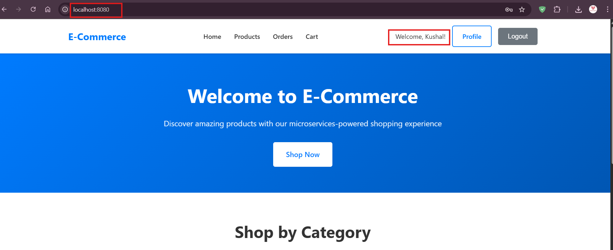
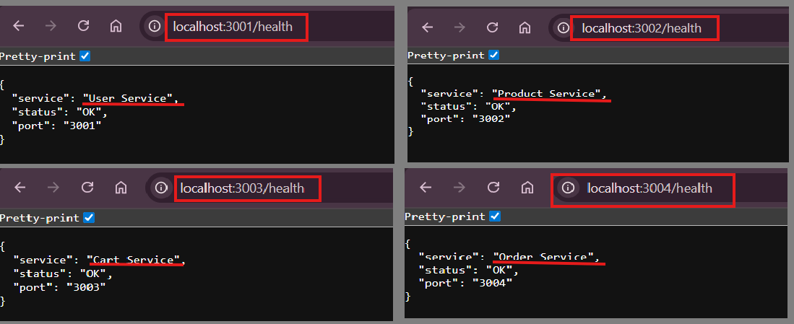
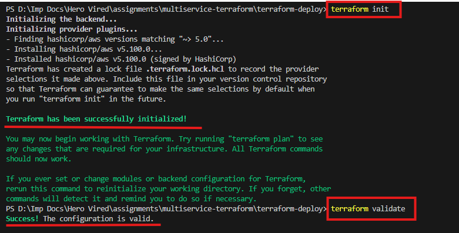
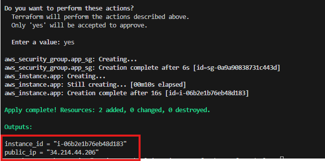
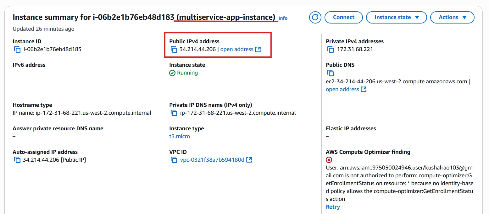
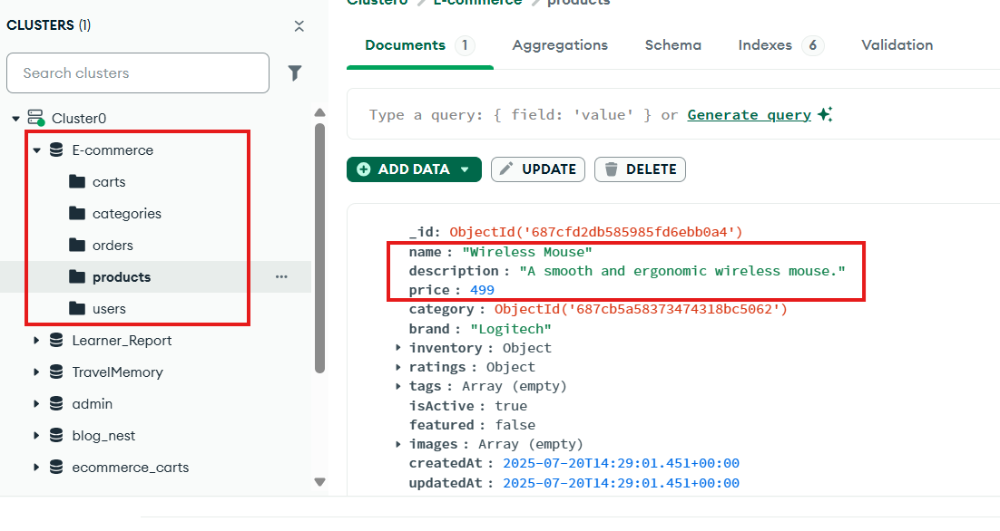
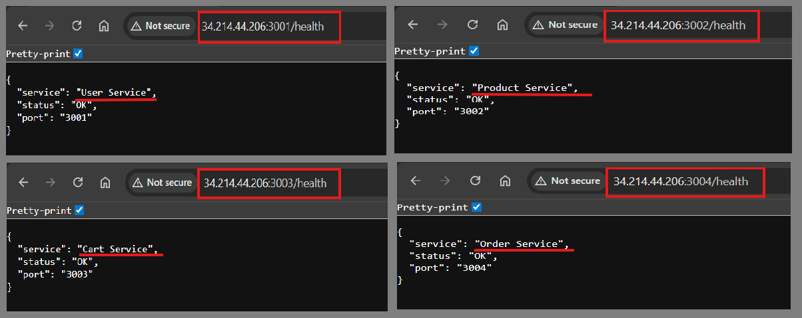
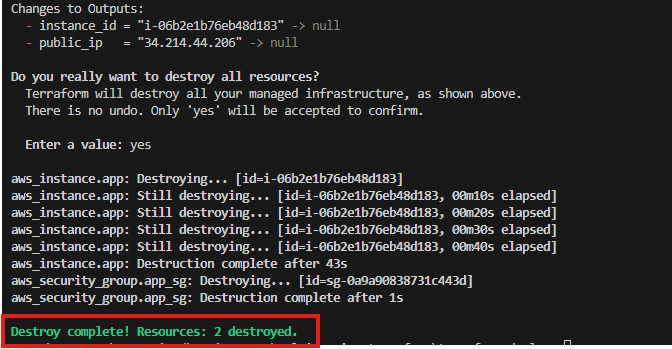
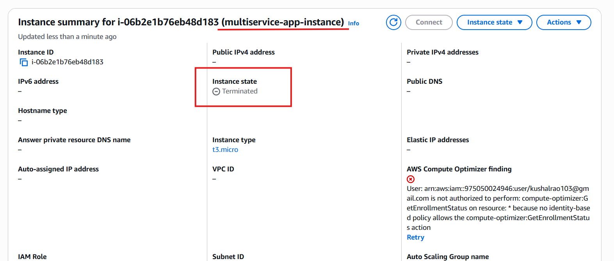

# Infrastructure and Automation with Microservices using Terraform

**Author:** U Kushal Rao  
**Project:** Infrastructure and Automation with Microservices using Terraform  
**Date:** Sept 21, 2025

---

## Overview

This document describes the end‑to‑end steps performed during the assignment: from a local dry‑run using Docker Compose to provisioning infrastructure on AWS using Terraform, validating the deployment, verifying service health and connectivity to MongoDB Atlas, and finally tearing down the infrastructure.

It is written to be a reference for reproducibility, handover and grading.

---

## Table of Contents

- [Project layout & files](#project-layout--files)  
- [Prerequisites](#prerequisites)  
- [Local dry-run (Docker Compose)](#local-dry-run-docker-compose)  
- [Terraform deployment (AWS)](#terraform-deployment-aws)  
  - [Initialize & validate](#initialize--validate)  
  - [Plan & Apply](#plan--apply)  
  - [Verify services & connectivity](#verify-services--connectivity)  
  - [Destroy / Cleanup](#destroy--cleanup)  
- [Troubleshooting & notes](#troubleshooting--notes)  
- [Screenshots](#screenshots)  
- [Appendix — useful commands & files](#appendix--useful-commands--files)

---

## Project layout & files

**Local `terraform-deploy` folder (snapshot):**

```
PS D:\Imp Docs\Hero Vired\assignments\multiservice-terraform\terraform-deploy> tree /f
Folder PATH listing for volume New Volume
Volume serial number is B8A7-1391
D:.
│   .terraform.lock.hcl
│   main.tf
│   outputs.tf
│   terraform.tfstate
│   terraform.tfstate.backup
│   terraform.tfvars
│   variables.tf
│   
└───.terraform
    └───providers
        └───registry.terraform.io
            └───hashicorp
                └───aws
                    └───5.100.0
                        └───windows_386
                                LICENSE.txt
                                terraform-provider-aws_v5.100.0_x5.exe
```

> **Files pushed to GitHub (security‑sanitized):**
> - `main.tf`  
> - `output.tf`  
> - `terraform_template.tfvars`  
> - `variables_template.tf`  

> **Screenshots folder (used in this doc):** `./screenshots/`  
> See the **Screenshots** section at the end for image references embedded in the steps.

---

## Prerequisites

- Local: Docker & Docker Compose installed and working.  
- Terraform v1.x (compatible with AWS provider v5.* used).  
- AWS CLI configured (if you want to query EC2 status from terminal).  
- A MongoDB Atlas cluster accessible from the deployed EC2 instances (whitelisted IPs / SRV connection string configured).  
- Basic knowledge of Nginx reverse proxy configuration for serving React frontend and proxying `/api` to backend services.

---

## Local dry-run (Docker Compose)

Purpose: verify services work locally before provisioning cloud resources.

1. Place `docker-compose.yml` in project root (or use the provided compose file).  
2. Pull images and start services:

```bash
# from terraform-deploy (or compose folder)
docker-compose pull
docker-compose up -d
# check running containers
docker-compose ps
# view logs for a service (e.g., frontend)
docker logs -f frontend
```

3. Verify frontend is serving and API routing is correct (example health checks / API hits):

```bash
# Frontend (React)
http://localhost:8080 

# Backend service health (example)
http://localhost:3001/health 

# Example env used in frontend (for local tests)
# REACT_APP_USER_SERVICE_URL=/api/user/
```
- *Screenshot: Frontend running locally with docker compose*

<p align="center">  </p>

<br>

- *Screenshot: All backend services running using docker compose images*

<p align="center">  </p>

<br>


4. Nginx note — sample `location` block to proxy `/api/*` to backend service:

```nginx
server {
  listen 80;
  root /usr/share/nginx/html;
  index index.html;

  location / {
    try_files $uri /index.html;
  }

  # Proxy API requests to backend service
  location /api/ {
    proxy_pass http://localhost:3001/;   # adjust host:port to backend
    proxy_set_header Host $host;
    proxy_set_header X-Real-IP $remote_addr;
    proxy_set_header X-Forwarded-For $proxy_add_x_forwarded_for;
  }
}
```


---

## Terraform deployment (AWS)

> **Goal:** Provision EC2 instances (frontend & backend), security groups, and any other infra declared in `main.tf`, then deploy/configure services so the frontend can reach backend APIs and MongoDB Atlas.

### Initialize & validate

#### 1. From the `terraform-deploy` folder:

```bash
terraform init
terraform validate
```

- *Screenshot: Terraform init and validate*

<p align="center">  </p>

<br>

### Plan & Apply

#### 1. Generate a plan and review changes:

```bash
terraform plan
```

#### 2. Apply the approved plan:

```bash
terraform apply 
```

- *Screenshot: Terraform apply successful*

<p align="center">  </p>

<br>

#### 3. Check EC2 instance state (AWS Console OR CLI):

- *Screenshot: EC2 state after terraform apply*

<p align="center">  </p>

<br>

### Verify services & connectivity

#### 1. Verify frontend is reachable (public IP or ELB DNS):

```bash
# replace <frontend-url> with public IP or DNS
http://<frontend-url>/
```

#### 2. Verify frontend can reach backend APIs (example endpoints):

```bash
# From a browser or curl
http://<frontend-url>:3001/health
http://<frontend-url>:3002/health
```

- *Screenshot (frontend hitting APIs & Mongo Atlas):*

<p align="center">  </p>

<br>

#### 3. Verify MongoDB Atlas data (example screenshot shows `products` DB verification):

- *Screenshot:*

<p align="center">  </p>

<br>

#### 4. Verify backend health endpoints (all services should return healthy status):

- *Screenshot:*

<p align="center">  </p>

<br>

---

## Destroy / Cleanup

1. Run teardown to remove all resources:

```bash
terraform destroy
```

2. Verify EC2 instances terminated (AWS Console or CLI):

- *Screenshot:*

<p align="center">  </p>

<br>

- *Screenshot:*

<p align="center">  </p>

<br>

---

## Troubleshooting & notes

- **Common `ERR_CONNECTION_REFUSED`** when frontend cannot reach backend:
  - Confirm Nginx proxy `proxy_pass` target host:port is reachable from the EC2 instance.
  - Confirm backend process is listening on expected port (use `ss -ltnp` or `netstat -tulpen`).
  - Check Security Group inbound rules allow traffic between frontend and backend, and from your IP if testing from local.

- **Terraform AWS AuthFailure**:
  - Ensure AWS credentials used by Terraform/CLI are valid and have necessary IAM permissions.
  - Check environment variables or `~/.aws/credentials`.

- **Do not commit secrets/state files**:
  - Keep `terraform.tfstate` and provider plugin executables out of Git. Only push sanitized templates (`*_template.tfvars`, `variables_template.tf`) — as done here.

---

## Appendix — useful commands & tips

- Terraform:
```bash
terraform init
terraform validate
terraform plan
terraform apply
terraform destroy

```

- Docker:
```bash
docker-compose pull
docker-compose up -d
docker-compose ps
docker logs -f <service>
docker-compose down
```

<br>

## Conclusion
- Completed full cycle: local dry-run with Docker Compose → Terraform `plan` & `apply` → verify → `destroy`.
- Frontend and backend verified with health checks; all APIs responded correctly.
- Successful connectivity to MongoDB Atlas and verification of application data.
- Infrastructure was provisioned and torn down reliably using Terraform (EC2 lifecycle confirmed).
- Sensitive files/state were kept out of Git — only sanitized templates were pushed.
- Key takeaways: always dry-run locally, confirm security group and Nginx proxy settings, and validate AWS credentials.